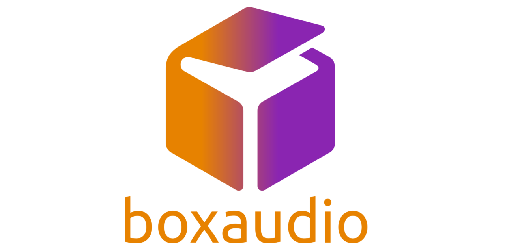

# boxAudio

[PWA](https://en.wikipedia.org/wiki/Progressive_web_applications) Audio player for streaming audio directly from [Dropbox](https://dropbox.com).
Based on idea of [RoteSonne.js](https://github.com/industral/RoteSonne.js) audio player.

### Features

- **Supported formats**: FLAC, WavPack, Ogg, mp3, AAC
- **No server side is required. Everything on client site!**
- **Caching audio chunks** (not implemented yet)

### Stack

- TypeScript
- Vue.js, Vuex
- Sass
- PWA (ServiceWorker, Cache)
- IndexDB (Dexie.js)
- Lottie animation
- Aurora.js (flac.js, mp3.js, alac.js, aac.js)
- Dropbox SDK
